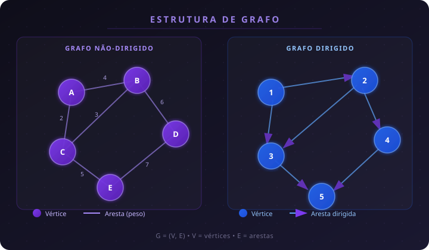

# 📘 Capítulo 4 — O Cálculo Diferencial que Modela as Variações do Sistema Energético

> Resumo do capítulo para a disciplina de **Matemática / Cálculo Diferencial** — FIAP  
> Autor do material: Prof. (elaborado em 2026)
---

## 👤 Informações do Aluno

- **Nome:** Isabelle Caroline de Camargo Francisco  
- **RM:** 572096  
- **Curso:** Ciência da Computação EAD  
- **Instituição:** FIAP  
- **Disciplina:** Matemática / Cálculo Diferencial  

---

## 📌 Assuntos Abordados

- **Limites** — Conceito, notação, limites laterais e propriedades
- **Derivadas** — Definição formal, interpretação geométrica e regras de derivação
- **Derivadas de ordem superior** — Segunda derivada, pontos críticos e concavidade
- **Aplicações** — Juros compostos, física, regra de L'Hôpital, aproximação de Taylor e otimização
- **Ferramentas Python** — SymPy (simbólico), NumPy (numérico) e JAX (autodiff)

---

## 🧠 Visão Geral

Grafos são estruturas usadas para modelar **redes**: cidades e estradas, pessoas e relações sociais, roteadores e enlaces. Um grafo é formado por **vértices** (entidades) e **arestas** (conexões entre elas). O capítulo cobre desde o vocabulário básico até algoritmos clássicos de busca e caminho mínimo.



### 🔹 Notação de uma aresta

Uma aresta é representada por um par de vértices:

e = (u, v)

Onde:
- **u** representa um dos vértices da ligação;
- **v** representa o outro vértice da ligação.

Em um **grafo não direcionado**, (u, v) e (v, u) representam a mesma conexão.

Em um **grafo direcionado**, a ordem importa: (u, v) indica uma ligação de **u para v**.
---
## 🔗 Representação de Arestas em Grafos

Em um grafo, uma **aresta** representa a ligação entre dois vértices. Essa ligação pode ser representada pela notação **(u, v)**, em que **u** e **v** são os vértices conectados.

Nos **grafos não direcionados**, a conexão é bidirecional, ou seja, (u, v) e (v, u) representam a mesma ligação.

Já nos **grafos direcionados (dígrafos)**, a ordem dos vértices é importante. A aresta **(u, v)** indica uma ligação que parte de **u** e chega em **v**, sem que isso signifique necessariamente a existência da ligação inversa **(v, u)**.

### Exemplo

```
A ───▶ B
```

Nesse caso, existe uma ligação de **A para B**, mas não obrigatoriamente de **B para A**.

---

## 📋 Matriz de Adjacência

Uma das formas mais comuns de representar um grafo é por meio da **matriz de adjacência**.

Nessa representação, cada linha e cada coluna correspondem a um vértice. O valor armazenado na posição **(u, v)** informa se existe uma aresta ligando **u** até **v**.

Por esse motivo, a matriz de adjacência permite verificar de forma muito rápida se existe uma conexão entre dois vértices específicos, bastando consultar a posição correspondente na matriz.

Embora seja simples e eficiente para consultas, essa estrutura pode consumir bastante memória em grafos com poucas arestas, pois reserva espaço para todas as possíveis conexões entre os vértices.

## 📂 Conceitos Fundamentais

### 1️⃣ Limites de Funções

- **Limite**: valor ao qual f(x) se aproxima quando x → p, sem necessariamente atingir p
- **Notação**: lim x→p f(x) = L
- **Limites laterais**: avaliação pelo lado esquerdo (x→p⁻) e pelo lado direito (x→p⁺)
- **Limite bilateral**: existe somente se os dois limites laterais forem iguais
- **Formas indeterminadas**: resultados como 0/0 ou ∞/∞ exigem simplificação algébrica antes de concluir

> A existência do limite bilateral em um ponto está diretamente ligada à **continuidade** da função naquele ponto: lim x→c f(x) = f(c).

#### 🔹 Propriedades de Limites

| Propriedade | Expressão matemática |
|---|---|
| **Soma** | lim [f(x) + g(x)] = lim f(x) + lim g(x) |
| **Produto** | lim [f(x) · g(x)] = lim f(x) · lim g(x) |
| **Quociente** | lim [f(x)/g(x)] = lim f(x) / lim g(x), desde que lim g(x) ≠ 0 |
| **Constante × função** | lim [c · f(x)] = c · lim f(x) |
| **Função composta** | lim f(g(x)) = f(lim g(x)), se f contínua em lim g(x) |

#### 🔹 Computação de Limites com SymPy

```python
import sympy as sp
x = sp.symbols('x')
f = (x+1)/(x-1)

sp.limit(f, x, 2)           # limite em x=2
sp.limit(f, x, 1, dir='+')  # limite lateral direito
sp.limit(f, x, 1, dir='-')  # limite lateral esquerdo
sp.limit(f, x, sp.oo)       # limite no infinito
```

---

### 2️⃣ Derivadas de Funções de Uma Variável

A **derivada** é definida formalmente como:

f'(x) = lim Δx→0 [f(x + Δx) − f(x)] / Δx

Ela é um **operador** que atua sobre uma função e produz outra função, indicando a proporção da mudança de y em relação à mudança de x — ou seja, a **taxa de variação instantânea**.

#### 🔹 Interpretação Geométrica

- A derivada em um ponto é o **coeficiente angular da reta tangente** ao gráfico naquele ponto
- f'(x) > 0 → função **crescente**
- f'(x) < 0 → função **decrescente**
- f'(x) = 0 → função **estacionária** (candidato a ponto crítico)

#### 🔹 Derivadas Conhecidas

| Função original | Derivada |
|---|---|
| f(x) = c | f'(x) = 0 |
| f(x) = xⁿ | f'(x) = nxⁿ⁻¹ |
| f(x) = eˣ | f'(x) = eˣ |
| f(x) = ln x | f'(x) = 1/x |
| f(x) = sin x | f'(x) = cos x |
| f(x) = cos x | f'(x) = −sin x |
| f(x) = tan x | f'(x) = sec²x |

#### 🔹 Propriedades de Derivadas

| Propriedade | Regra |
|---|---|
| **Soma** | (f + g)' = f' + g' |
| **Produto** | (f · g)' = f'g + fg' |
| **Quociente** | (f/g)' = (f'g − fg') / g² |
| **Regra da cadeia** | f(g(x))' = f'(g(x)) · g'(x) |
| **Constante multiplicativa** | (c · f)' = c · f' |

```python
import sympy as sp
x = sp.Symbol('x')
sp.diff(x**3 - 3*x**2 + 2, x)        # regra do tombo
sp.diff(sp.sin(x) * sp.exp(x), x)    # regra do produto
sp.diff(sp.sin(x**2), x)             # regra da cadeia
```

#### 🔹 Funções Não Diferenciáveis

Uma função pode ser **contínua** em todos os pontos e ainda assim **não diferenciável** em alguns deles. Exemplo clássico: f(x) = |x|, que não é diferenciável em x = 0 porque os coeficientes angulares à esquerda (−1) e à direita (+1) são diferentes.

---

### 3️⃣ Derivadas de Ordem Superior

| Ordem | Notação (Leibniz) | Notação (Lagrange) | Notação (Newton) |
|---|---|---|---|
| 1ª | dy/dx | f'(x) | ẋ |
| 2ª | d²y/dx² | f''(x) | ẍ |
| 3ª | d³y/dx³ | f'''(x) | ẍ̇ |

```python
import sympy as sp
x = sp.symbols('x')
f = x**4 - 3*x**3 + 2*x**2 - x + 1

sp.diff(f, x)     # 1ª derivada
sp.diff(f, x, 2)  # 2ª derivada
sp.diff(f, x, 3)  # 3ª derivada
```

> ⚠️ Com NumPy, a aplicação repetida de `np.gradient` amplifica erros numéricos nas bordas. SymPy retorna resultados exatos via `sp.diff`.

---

### 4️⃣ Pontos Críticos

Um **ponto crítico** é um valor x₀ onde f'(x₀) = 0 ou f'(x₀) não existe. A natureza do ponto é determinada pelo **teste da segunda derivada**:

| Condição | Conclusão |
|---|---|
| f'(x₀) = 0 e f''(x₀) > 0 | Mínimo local |
| f'(x₀) = 0 e f''(x₀) < 0 | Máximo local |
| f'(x₀) = 0 e f''(x₀) = 0 | Teste inconclusivo |
| f''(x) muda de sinal em x₀ | Ponto de inflexão |

> ⚠️ f'(x₀) = 0 **não garante** extremo local. O caso f(x) = x³ em x = 0 é um ponto de inflexão com tangente horizontal, não um extremo.

---

## 🔢 Aplicações de Limites e Derivadas

### 5️⃣ Juros Compostos e a Constante de Euler

O montante em juros compostos com capitalização n vezes por período é:

M = C · (1 + r/n)^(t·n)

Quando n → ∞ (capitalização contínua), com C = 1, r = 1 e t = 1, obtemos:

lim x→∞ (1 + 1/x)ˣ = **e ≈ 2,71828**

O número de Euler surge naturalmente como o limite do montante em capitalização instantânea.

```python
from sympy import *
x = symbols('x')
limit((1 + 1/x)**x, x, oo)  # Retorna: E
```

---

### 6️⃣ Aplicação na Física (MUV)

Em movimento uniformemente variado, posição, velocidade e aceleração se relacionam por derivadas:

- x(t) = x₀ + v₀t + ½a₀t² → **posição** (polinômio de 2º grau)
- v(t) = x'(t) = v₀ + a₀t → **velocidade** (crescimento linear)
- a(t) = v'(t) = a₀ → **aceleração** (constante)

---

### 7️⃣ Regra de L'Hôpital

Utilizada para resolver limites na **forma indeterminada** (0/0 ou ∞/∞): deriva-se numerador e denominador separadamente e aplica-se o limite novamente.

**Exemplo:** lim x→0 sin(x)/x → derivando: lim x→0 cos(x)/1 = **1**

```python
import sympy as sp
x = sp.symbols('x')
sp.limit(sp.sin(x)/x, x, 0)  # Retorna: 1
```

---

### 8️⃣ Expansão de Taylor de 1ª Ordem

Aproximação linear de uma função em torno de um ponto x₀:

f(x) ≈ f(x₀) + f'(x₀)(x − x₀)

Útil para simplificar modelos não-lineares em regiões locais. Exemplo clássico: sin(θ) ≈ θ para ângulos pequenos no pêndulo simples.

---

### 9️⃣ Otimização com Gradiente Descendente

Algoritmo iterativo que minimiza funções seguindo a direção oposta ao gradiente:

**1D:** x^(t+1) = xᵗ − η · f'(xᵗ)

**Multivariável:** x^(t+1) = xᵗ − η · ∇f(xᵗ)

Onde η é a **taxa de aprendizagem** (tamanho do passo).

| Parâmetro | Impacto |
|---|---|
| **η pequeno** | Convergência lenta, mais iterações |
| **η grande** | Pode pular o mínimo e divergir |
| **Ponto inicial** | Determina qual mínimo local é encontrado |

> ⚠️ Em funções com múltiplos mínimos locais, pontos iniciais muito próximos podem convergir para mínimos completamente diferentes.

---

### 🔟 Diferenciação Automática com JAX

**Autodiff** não é nem numérico nem simbólico: armazena como funções básicas se compõem em um grafo computacional e aplica a **regra da cadeia** de forma algorítmica, obtendo derivadas exatas com eficiência.

| Abordagem | Característica | Ferramenta |
|---|---|---|
| **Numérica** | Aproximada, erros de arredondamento | NumPy (`np.gradient`) |
| **Simbólica** | Exata, pode ser lenta em expressões grandes | SymPy (`sp.diff`) |
| **Autodiff** | Exata e eficiente, base do aprendizado profundo | JAX (`grad`) |

```python
import jax.numpy as jnp
from jax import grad

def f(x):
    return x**3 + 2*x

df = grad(f)
df(3.0)  # Avalia a derivada exata em x = 3.0
```

---

## 📊 Comparação das Abordagens Computacionais

| Abordagem | Precisão | Eficiência | Uso principal |
|---|---|---|---|
| **NumPy / np.gradient** | Aproximada | Alta | Derivadas numéricas rápidas em arrays |
| **SymPy / sp.diff** | Exata | Média | Cálculo simbólico e expressões analíticas |
| **JAX / grad** | Exata | Muito alta | Otimização, machine learning, gradientes em larga escala |

---

## ⚠️ Cuidados Importantes

- **Formas indeterminadas** (0/0, ∞/∞) exigem simplificação antes de concluir que o limite não existe
- **f'(x₀) = 0** não garante extremo — o teste da segunda derivada pode ser inconclusivo
- **Derivadas numéricas repetidas** (np.gradient) amplificam erros nas bordas do domínio
- **Taxa de aprendizagem** no gradiente descendente deve ser ajustada cuidadosamente
- **Mínimo local vs global**: gradiente descendente não garante o mínimo global

---

## 🗂️ Resumo Geral

| Conceito | Definição |
|---|---|
| **Limite** | Valor que f(x) se aproxima quando x → p |
| **Continuidade** | lim x→c f(x) = f(c) |
| **Derivada** | Taxa de variação instantânea; inclinação da reta tangente |
| **Regra do tombo** | d/dx(xⁿ) = nxⁿ⁻¹ |
| **Regra da cadeia** | d/dx f(g(x)) = f'(g(x)) · g'(x) |
| **Ponto crítico** | x₀ onde f'(x₀) = 0 ou não existe |
| **Ponto de inflexão** | x₀ onde f''(x) muda de sinal |
| **Gradiente** | Vetor das derivadas parciais; direção de maior crescimento |
| **Autodiff** | Diferenciação exata via regra da cadeia algorítmica |
| **Número de Euler (e)** | lim x→∞ (1 + 1/x)ˣ ≈ 2,71828 |

---

## 📎 Referências

- DEISENROTH, M. P.; FAISAL, A.; ONG, C. S. **Mathematics for Machine Learning**. Cambridge University Press, 2020.
- FARRELL, P. et al. **The Statistics and Calculus with Python Workshop**. Packt Publishing, 2020.
- FERNANDES, D. B. (org.). **Cálculo Diferencial**. Pearson Education do Brasil, 2014.
- GONÇALVES, M. B.; FLEMMING, D. M. **Cálculo A: funções, limite, derivação e integração**. 6. ed. Pearson Education do Brasil, 2007.
- THOMAS, G. B.; WEIR, M. D.; HASS, J. **Cálculo, vol. 1**. 12. ed. Pearson Education do Brasil, 2012.

---

*Resumo feito para fins de estudo — FIAP*
